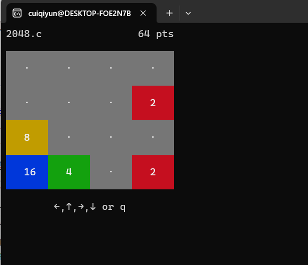

# RuyiSDK 应用示例

安装依赖包

```
sudo apt update; sudo apt install -y wget tar zstd xz-utils git build-essential
```

安装ruyi包管理器

```
wget https://mirror.iscas.ac.cn/ruyisdk/ruyi/tags/0.45.0/ruyi-0.45.0.amd64
chmod +x ruyi-0.45.0.amd64
sudo cp -v ruyi-0.45.0.amd64 /usr/local/bin/ruyi
```

安装GCC工具链

```
ruyi update
ruyi install gnu-plct 
```

## 2048

创建并激活ruyi虚拟环境（GCC)

```
ruyi venv -t toolchain/gnu-plct milkv-duo venv-2048
. ~/venv-2048/bin/ruyi-activate
```

验证GCC版本

```
riscv64-plct-linux-gnu-gcc -v
```

获取2048的源码

```
wget https://raw.githubusercontent.com/mevdschee/2048.c/master/2048.c
```

编译2048.c

```
riscv64-plct-linux-gnu-gcc 2048.c -static -o 2048-gcc
```


将GCC构建的二进制传输至开发板

```
scp 2048 root@192.168.42.1:~
```

SSH连接到开发板并执行编译好的二进制

```
ssh root@192.168.42.1
```

运行2048

```
./2048-gcc
```

正常情况下，终端会看到类似如下输出：

